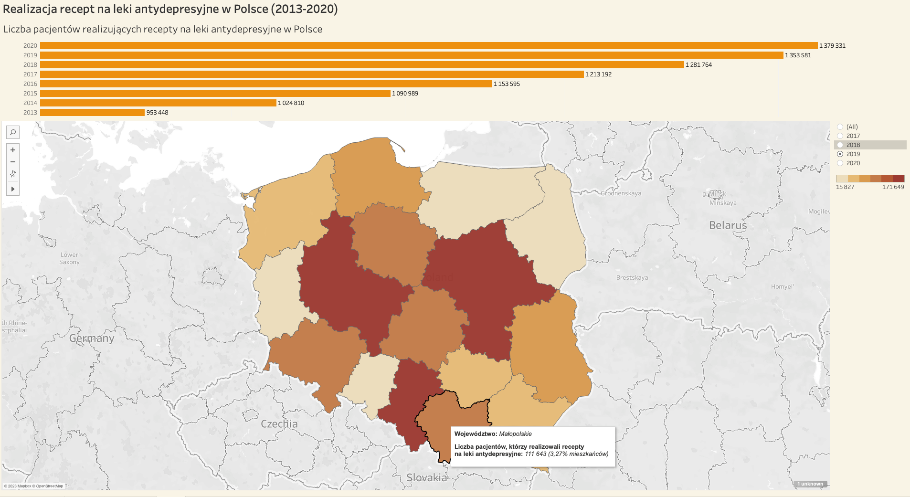

# Dashboard: Realizacja recept na antydepresanty w Polsce

<aside>
❗ The dashboard is only available in Polish at this point.

</aside>

# Generic

[Link to dashboard](https://public.tableau.com/shared/36TFGCKSF?:display_count=n&:origin=viz_share_link)

### Introduction

This is a sample dashboard made in Tableau, showing the prevalence of antidepressants in Poland, from 2013 to 2020.

### Data

The data on which the dashboard was based is available in open access at [https://stat.gov.pl/](https://stat.gov.pl/).

The datasets used to build the dashboard were prepared and made available by the polish e-health center ([http://ezdrowie.gov.pl](http://ezdrowie.gov.pl/))

### Variables and formulas

| Variable | Information |
| --- | --- |
| Rok [year] | - |
| Liczba pacjentów [number of patients] | number of patients processing prescriptions |
| Województwo [province] | - |
| Odsetek [proportion] | the percentage of the province's population who processed prescriptions |

### Screenshots

